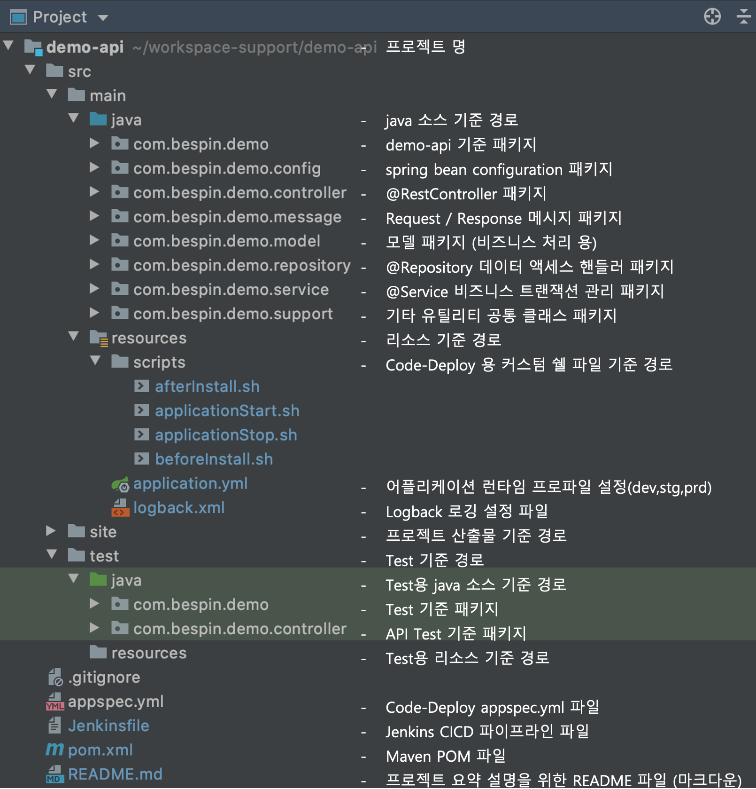

## Spring-Boot Application Flow Diagram
Spring-Boot MVC 프레임 워크는 다른 많은 웹 MVC 프레임 워크와 마찬가지로 요청 중심이며 
Dispatcher-Servlet을 중심으로 설계되어 요청을 컨트롤러에 위임하여 애플리케이션 개발을 용이하게 합니다.
Spring의 DispatcherServlet 의 강력한 특징은 Spring IoC 컨테이너와 완전히 통합되어 Spring의 다른 컴포넌트를  
필요하면 쉽게 사용할 수 있습니다.

<h3>처리 흐름 개요</h3>
- DispatcherServlet 이 요청을 수신합니다.
- DispatcherServlet 은 적절한 컨트롤러 를선택하는 작업을 HandlerMapping에 전달 합니다.
 HandlerMapping 은 수신 요청 URL에 맵핑 된 컨트롤러를 선택하고 (선택된 핸들러) 및 컨트롤러 를 DispatcherServlet으로 리턴 합니다.
- DispatcherServlet 은 Controller 의 비즈니스 로직 실행 태스크를 HandlerAdapter로 디스패치 합니다.
- HandlerAdapter 는 Controller 의 비즈니스 로직 프로세스를 호출합니다.
- Controller 는 비즈니스 로직을 실행하고 처리 결과를 Model에 설정하고 논리적 뷰 이름을 HandlerAdapter에 리턴합니다.
- DispatcherServlet 은 View 이름에 해당하는 View 를 해결하는 작업을 ViewResolver로 전달 합니다. ViewResolver 는뷰 이름에 매핑된 뷰를 반환합니다.
- DispatcherServlet 은 렌더링 프로세스를 리턴 된 View로 전달합니다.
- 뷰는 모델 데이터를렌더링하고 응답을 반환합니다.

---

## Demo API Project Template Layout

어플리케이션 아키텍처는 CoC(Convention over Configuration)을 기반으로, 별도의 설명 없이도 프로젝트/패키지/리소스 구조와 Naming 룰을 살펴 보고, 개발자가 적절한 구현을 하도록 가이드 합니다.

