# GitLab webhook 구성GitLab webhook 구성
GitLab에 jenkins webhook 구성을 연결하여 git에 commit이 일어나는 경우 자동 배포를 실행하게 한다.

## 1. GitLab 토큰 생성
> - Settings > Access Tokens
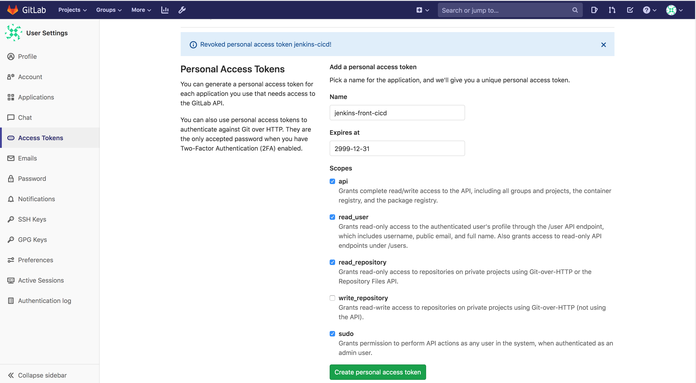
> - GitLab에서 생성된 토큰 값은 다시 확인이 불가능함으로 복사해서 갖고있는다.
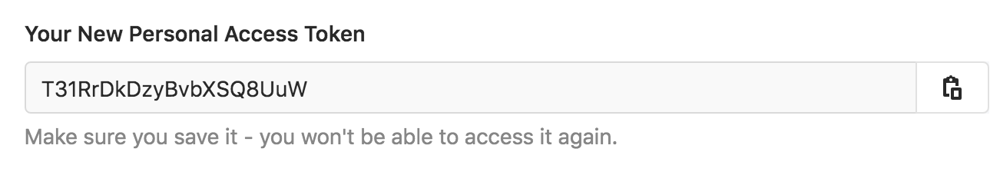
## 2. Jenkins 설정
### 2-1) Credentials 등록
> - 등록 화면
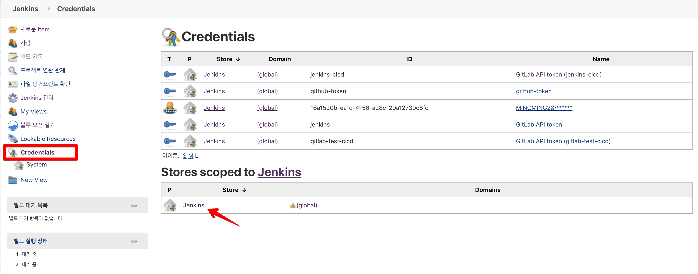
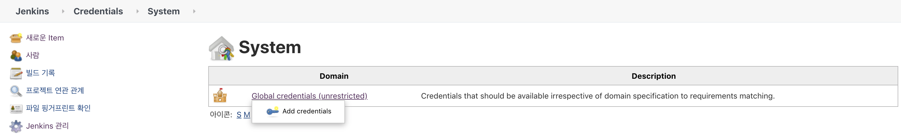
> - GitLab에서 발급 받은 토큰 값 설정
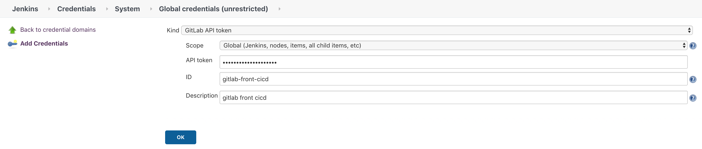
### 2-2) 시스템 GitLab 설정
> - jenkins credentials 선택
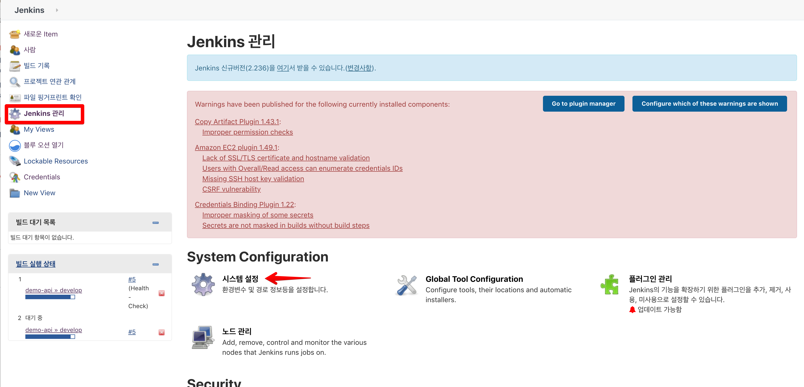
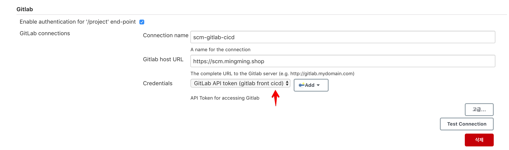

## 3. Jenkins webhook 설정
### 3-1) Jenkins webhook 정보 확인
> - Jenkins 화면에서 webhook url 정보를 확인한다.
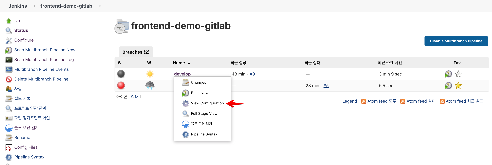
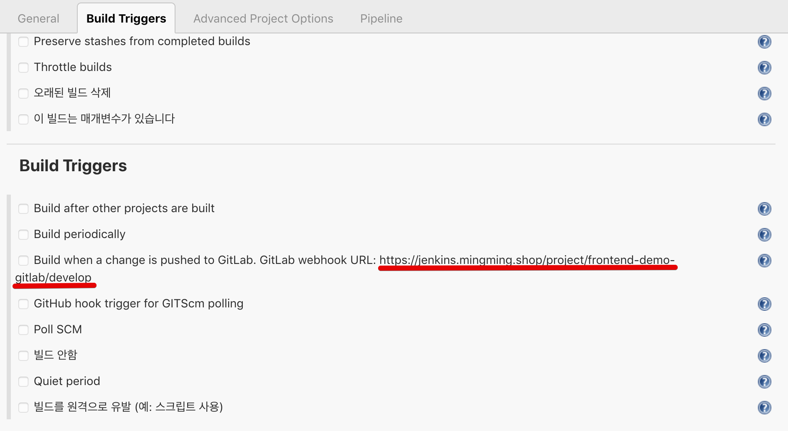

### 3-2) GitLab 등록
> - gitlab 화면에서 jenkins webhook url을 등록한다.
> - 등록
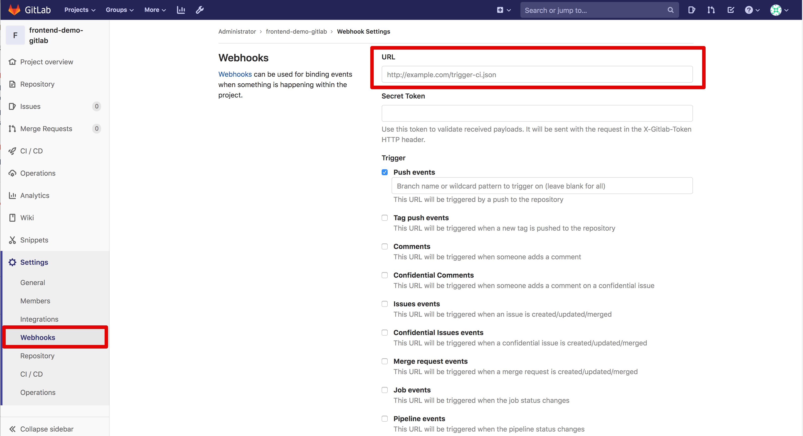
> - 테스트
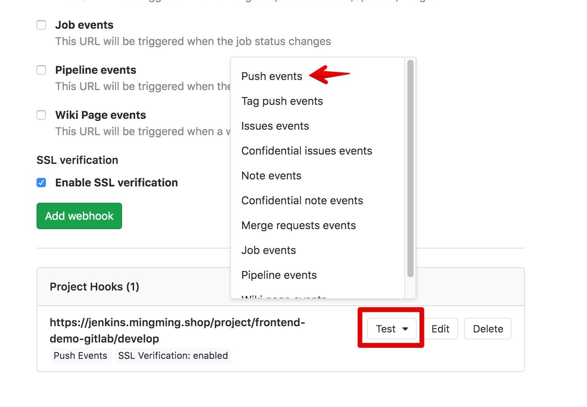
> - 결과
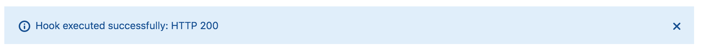