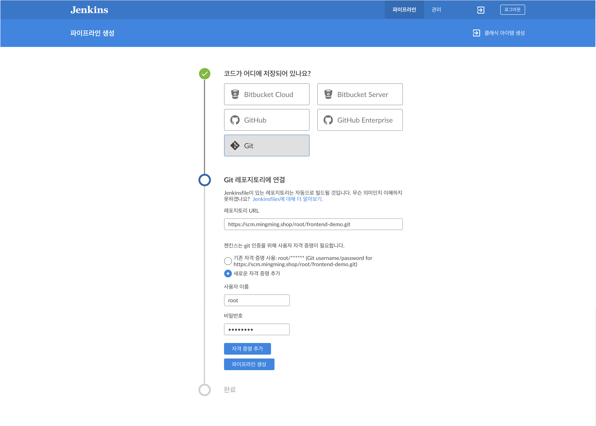
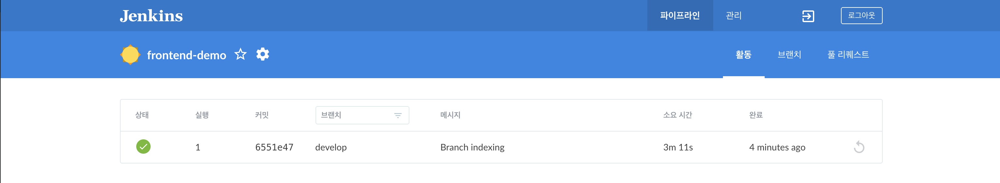
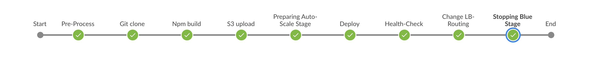

# Blue green jenkins 구성

## 1. jenkins pipeline 생성 (Blue ocean)
### 1-1) 배포 진행 선행작업
> - application(frontend) 프로젝트에 JenkinsFile 이 설정되어 있어야 한다.
> - code-deploy 의 어플리케이션과 그룹이 정상적으로 생성되어 있어야 된다.
> - code-deploy 가 정상 수행 가능하도록 프로젝트에 appspec.yml이 정상적으로 설정되어 있어야 한다.
>>(appspec.yml 파일은 code-deploy에서 배포시에 사용하는 파일)

### 1-2) 파이프라인 생성
> - '블루 오션 열기' 좌측 메뉴 클릭하여 파이프라인 생성

> - 배포 결과 확인

## 2. jenkins blue-green 배포 
### 2-1) 블루 그린 배포 파이프라인

### 2-2) 파이프라인 설명
> JenkinsFile 참조
~~~
pipeline {
    agent any
    stages {
        stage('Pre-Process') {
            사전 준비 단계로 배포에 필요한 변수값 셋팅한다. (blue, green 사용 변수)
        }
        
        stage('Git clone') {
            GitLab에서 frontend 프로젝트 clone 받는다.
        }
        
        stage ('Npm build') {
            git에서 받은 frontend 프로젝트 배포 파일을 생성한다.
        }
        
        stage ('S3 upload') {
            frontend 프로젝트 배포 파일을 zip 파일로 변경하여, S3에 저장한다.
        }
        
        stage('Preparing Auto-Scale Stage') {
            blue 가 사용인 경우 green Auto-scaling group을 최소 단위로 활성화 시킨다.
        }
        
        stage('Deploy') {
            AWS CodeDeploy를 실행하여, green에 frontend 를 배포한다.
        }
        
        stage('Health-Check') {
            AWS CodeDeploy 배포 완료를 기다린다.
        }
        
        stage('Change LB-Routing') {
            ALB에 맵핑되어 있는 blue와 green 의 target group을 변경하여 새로 배포돠어 있는 green을 사용가능하게 한다.
        }
        
        stage('Stopping Blue Stage') {
            기존에 사용중인 blue 영역을 정지시킨다.
        }
    }
}
~~~