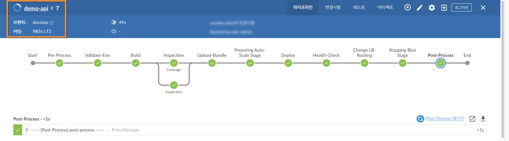

# CICD 상세 흐름

## demo-api CICD 파이프라인 상세 


````js
pipeline {
    agent any
    stages {
        stage('Pre-Process') {
            사전 준비 단계로 배포에 필요한 환경 변수 등을 설정 합니다.
        }

        stage('Validate-Env') {
            환경 변수 및 배포에 필요한 리소스 구성이 올바른지 유효성 검증을 실행 합니다.
        }

        stage('Build') {
           Maven 빌드를 실행 합니다.
        }

        stage('Inspection') {
            Code 정적 분석을 진행 합니다.

            JUnit(Code Coverage) 단위 테스트를 진행 합니다.
        }

        stage('Upload-Bundle') {
            배포에 필요한 bundle 이미지를 빌드 하고 S3에 업로드 합니다.
        }

        stage('Preparing Auto-Scale Stage') {
            Green 스테이지를 위한 Auto-Scaling-Group을 준비 합니다.
        }

        stage('Deploy') {
            CodeDeploy 의 배포 그룹을 실행 합니다.
        }

        stage('Health-Check') {
            Green 스테이지의 서비스 상가 정상인지 확인 합니다.
        }

        stage('Change LB-Routing') {
            ALB의 라우팅 경로를 Blue 스테이지에서 Green 스테이지로 전환 합니다.
        }

        stage('Stopping Blue Stage') {
            Blue 스테이지의 서비스를 중지 및 종 합니다.
        }

        stage('Post-Process') {
            CICD 배포를 완료 합니다.
        }
    }
}

````

<!--a href="../../Jenkinsfile" target="_blank">Jenkinsfile 참조</a> //-->

