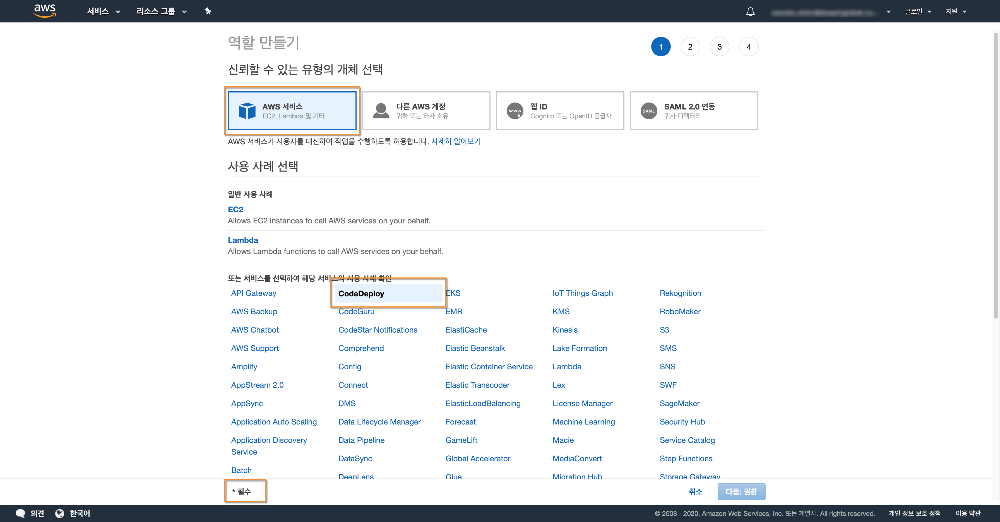

# IAM 역할만들기
> - Code-deploy를 사용하여 배포하기 위해서는 'EC2'와 'CODE-DEPLOY'에 역할이 생성되어야한다.

## 1. 공통 메뉴

## 2. EC2 역할 생성
> - EC2 역할은 aws lunch-template 생성시에 설정해준다.

>

## 3. code-deploy 역할 생성
> - code-deploy 역할 어플리케이션 생성시에 설정해준다.

