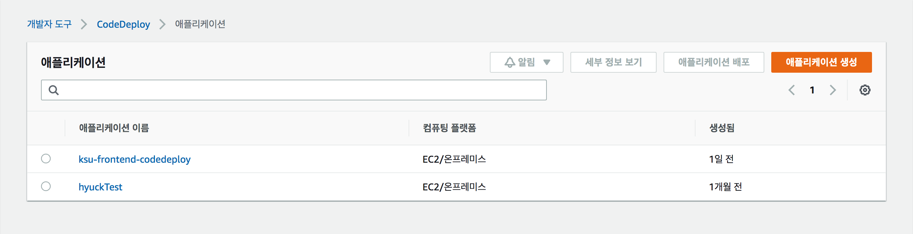
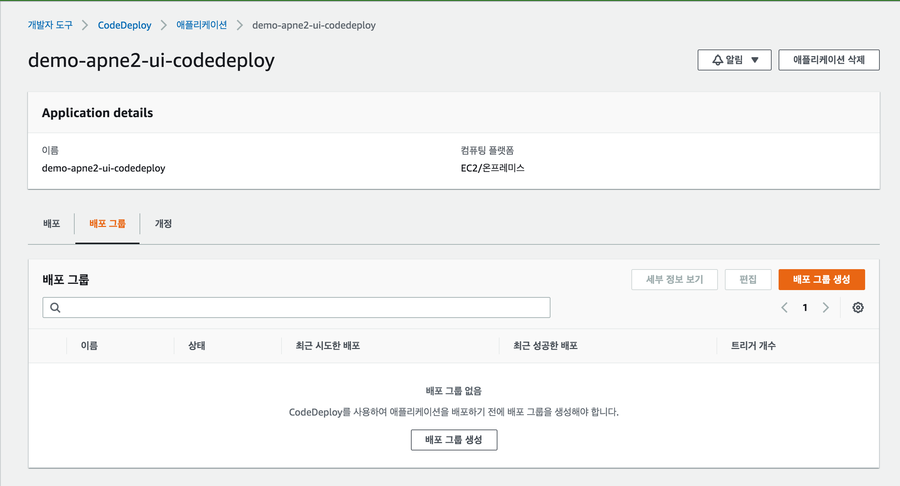
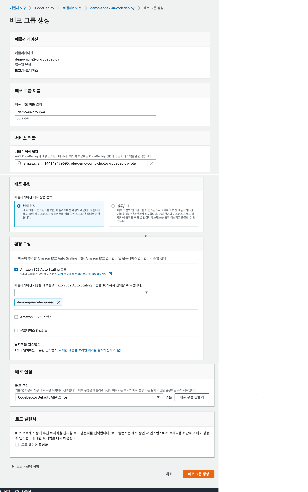
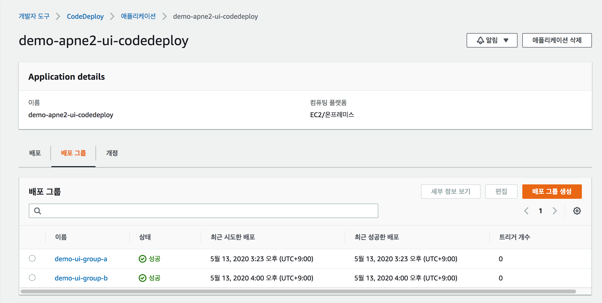

# code-deploy 구성
> - frontend 를 배포할 Code-deploy 1개의 어플리케이션과 2개의 그룹을 생성한다.
> - 2개의 그룹은 배포진행 할 auto-scaling 갯수에 맞춰서 생성한다.
## 1. 어플리케이션 생성

## 2. 배포 그룹 생성
### 2-1) 배포 그룹 생성
> - brue green 배포시 어플리케이션에 2개의 Auto Scaling을 연결해주는 그룹을 생성한다.

### 2-2) 배포 그룹 생성 확인 (2개)
