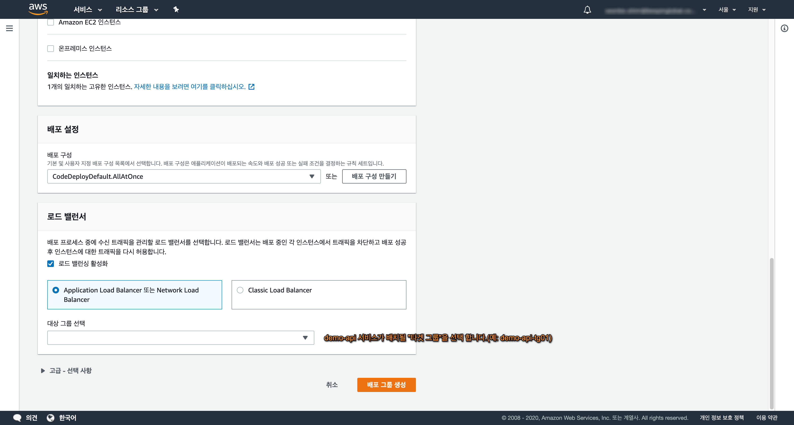

# CodeDeploy 구성
Demo 애플리케이션(demo-api) 배포를 위해 CodeDeploy 애플리케이션을 생성 합니다.

## 1. 구성 요소
CodeDeploy를 통한 Blue/Green 배포를 위해 다음의 과정이 필요 합니다.
> 1. CodeDeploy 애플리케이션 생성  
> 2. CodeDeploy의 배포그룹 생성 

CodeDeploy의 타겟 스테이지는 배포를 관장하는 오토스케일그룹이며 실제 로는 다음의 리소스가 연결 됩니다.

<h3>CodeDeploy 자원 구성 예시</h3> 

| 구분  | 애플리케이션    | 배포 그룹 | 오토스케일 그룹 | 타겟 그룹 | 시작 템플릿 | AMI |
| :----------: | :----------: | :-----------: | :-----------: | :-----------: | :-----------: | :-----------: |
| 블루 | demo-api | group-a | demo-api-asg-01 | demo-api-tg-01 | demo-api-lt | demo-api-ami | 
| 그린 | demo-api | group-b | demo-api-asg-02 | demo-api-tg-02 | demo-api-lt | demo-api-ami | 

dev, stg, prd 와 같이 환경이 구분 된다면 더 많은 구성 요소를 필요로 합니다.

| 구분  | 애플리케이션    | 배포 그룹 | 오토스케일 그룹 | 타겟 그룹 | 시작 템플릿 | AMI | 
| :----------: | :----------: | :-----------: | :-----------: | :-----------: | :-----------: | :-----------: | 
| dev 블루 | demo-api-dev | group-a | demo-api-dev-asg-01 | demo-api-dev-tg-01 | demo-api-lt | demo-api-ami |
| dev 그린 | demo-api-dev | group-b | demo-api-dev-asg-02 | demo-api-dev-tg-02 | demo-api-lt | demo-api-ami |
| stg 블루 | demo-api-stg | group-a | demo-api-stg-asg-01 | demo-api-stg-tg-01 | demo-api-lt | demo-api-ami |
| stg 그린 | demo-api-stg | group-b | demo-api-stg-asg-02 | demo-api-stg-tg-02 | demo-api-lt | demo-api-ami |
| prd 블루 | demo-api-prd | group-a | demo-api-prd-asg-01 | demo-api-prd-tg-01 | demo-api-lt | demo-api-ami |
| prd 그린 | demo-api-prd | group-b | demo-api-prd-asg-02 | demo-api-prd-tg-02 | demo-api-lt | demo-api-ami |

---

## 2. 애플리케이션 구성

- CodeDeploy > 배포 > 애플리케이션 메뉴의 "애플리케이션 생성" 을 통해 구성을 시작 합니다. 

 

- 애플리케이션 이름과 컴퓨팅 플랫폼을 선택하고 "애플리케이션 생성" 버튼을 클릭 합니다.  

 

---

## 3. 배포 그룹 구성

3 애플리케이션이 생성 되면 실제로 배포 진행을 관장 하는 배포 그룹을 생성 합니다.

**`중요`** Blue/Green 배포를 위해선 Blue에 대한 배포 그룹과 Green에 대한 배포 그룹 각각이 구성 되어야 합니다.
 

 

- 배포 그룹 생성: "배포 그룹 이름"을 기입 하고 "서비스 역할"을 선택 합니다. 

Blue 또는 Green 스테이지에 해당 하는 배포 그룹 이름을 입력(예: group-a) 하고 CodeDeploy Agent 가 사용할 롤(예: code-deploy-role)을 선택 합니다.

 

- 배포 그룹 생성: "배포 유형"과 "오토 스케일 그룹"을 선택 합니다.
참고로, 배포 유형은 "현재 위치"와 "블루 그린" 두 가지 유형이 있으며, Blue/Green 임에도 "현재 위치"를 선택 해야 합니다.

CodeDeploy의 환경 구성으로 "Amazon EC2 Auto Scaling 그룹" 을 체크하고 애플리케이션 개정을 배포할 오토 스케일링 그룹(예: demo-api-asg-01)을 선택 합니다. 

 

- 배포 그룹 생성: "배포 유형"과 "오토 스케일 그룹"을 선택 합니다.

"배포 설정"을 "CodeDeployDefault.AllAtOne"를 선택 하고 로드 밸런서를 선택 한뒤 demo-api가 배치될 대상 그룹(예: demo-api-tg-01)을 선택 합니다.

