# Base 이미지 구성
demo-api 서비스에 최적화된 베이스 이미지를 구성 합니다.

베이스 이미지는 대게 아래와 같은 기본 구성을 포함 합니다.
~~~ 
    - OS
    - SDK 환경 구성(Java 어플리케이션인 경우 JDK 설치)
    - CodeDeploy 에이전트 구성
    - 기본적인 보안 컴플라이언스 기능 구성
~~~

참고로, DevOps 자동화 고도화를 위해서 통합 모니터링과 통합 로그 수집을 위한 솔루션을 추가 구성 할 수도 있습니다.

demo-api를 위한 Base Image는 아래의 순서로 구성 합니다. 
1. Amazon EC2 인스턴스 생성
2. Java SDK 설치 및 health-api 어플리케이션 설치 
3. demo-api-ami 이미지 생성 

## 1. Amazon EC2 인스턴스 생성

- EC2 > 인스턴스의 "인스턴스 시작" 메뉴를 통해 시작 합니다. 
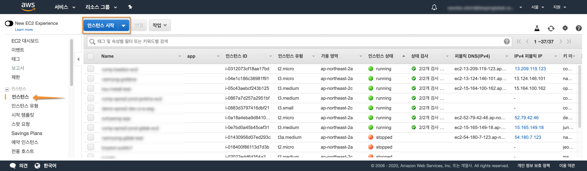

 

- "Amazon Linux 2 AMI"를 선택 합니다. 참고로, Blue/Green 배포에서 인스턴스 구동 시간이 가장 짧고, CodeDeploy 구성에 최적화 되어 있습니다. 
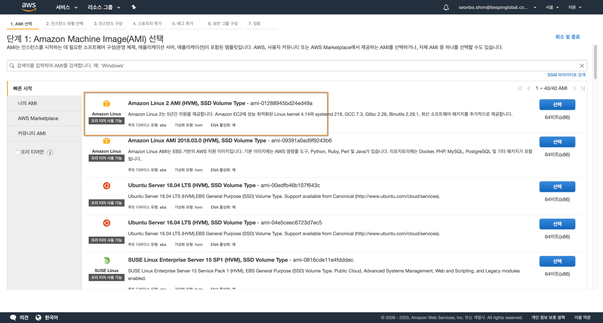

 

- 인스턴스 타입을 "t3.small" 로 선택 합니다. 
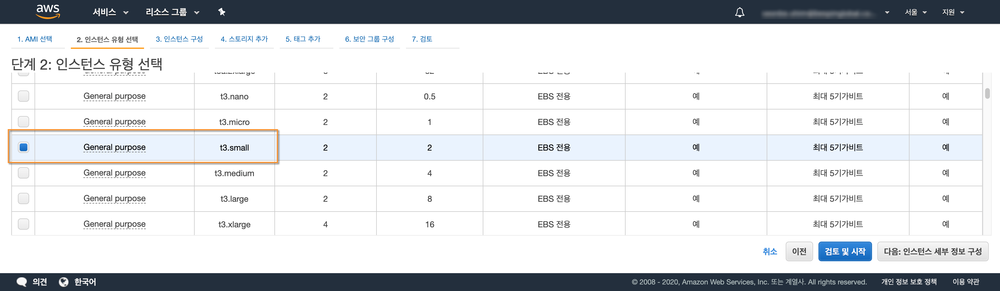

 

- EC2 인스턴스 생성 검토를 마치고 하단의 "시작하기" 버튼을 누르면 EC2 인스턴스가 생성 됩니다.
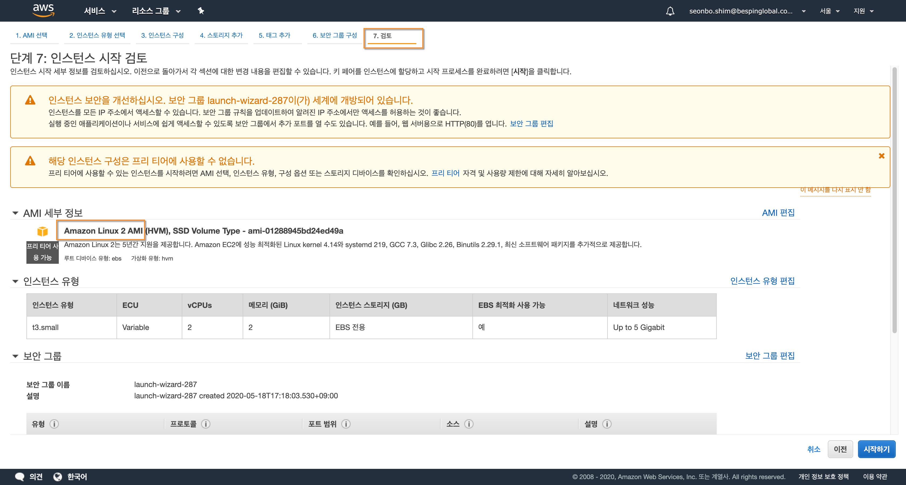

 

- 신규로 생성되는 인스턴스에 대해 터미널 접속에 필요한 key-pair를 지정 할 수 있습니다. (key-pair을 사전에 구성한 경우)
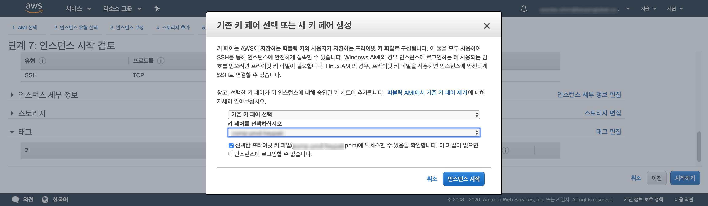

 

- 인스턴스가 생성되는과정을 확인 할 수 있습니다.
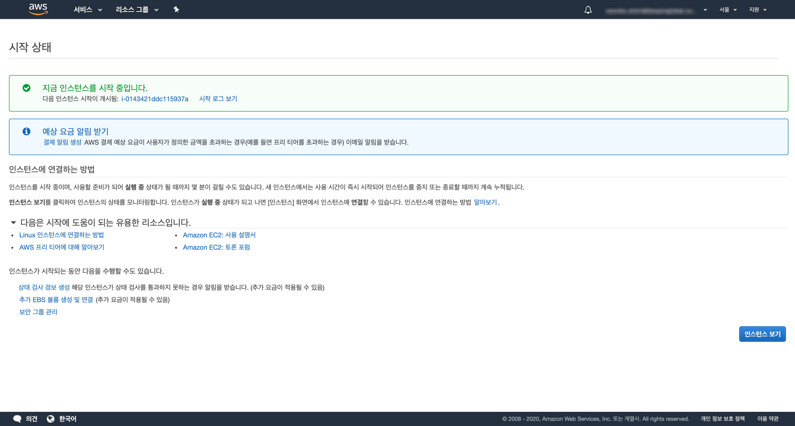

 

---

## 2. EC2 인스턴스 접속 및 환경 구성

- 생성된 인스턴스(예: demo-api-ami)를 선택하고 "작업 > 연결" 을 통해 터미널로 접속 합니다.
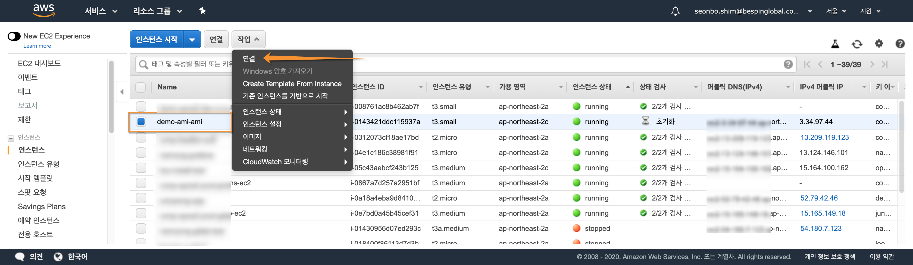

 

- 연결 방법을 선택 하고 연결 버튼을 누릅니다.
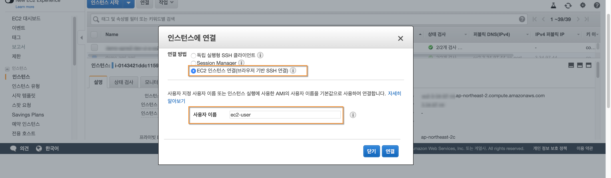

 

- 접속된 이후 Java SDK 설치와 health-api.jar 등을 구성 합니다.
애플리케이션인 경우 타겟 그룹에서 정상적인 상태 여부에 대해 health 체크를 통과해야만 하는데 초기 구성에 대한 health 통과를 목적으로 합니다. 
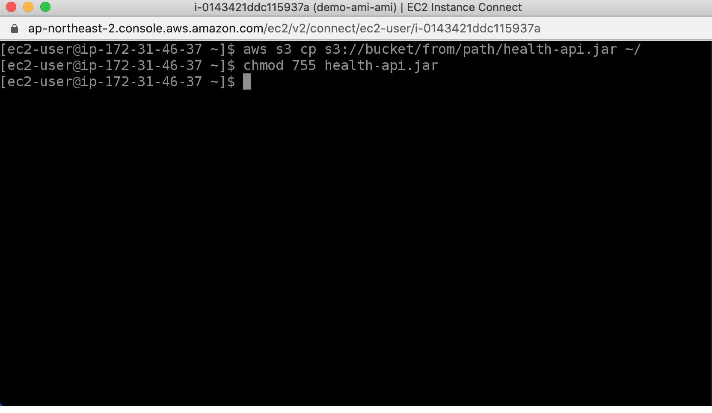

<a href="https://docs.aws.amazon.com/ko_kr/corretto/latest/corretto-8-ug/amazon-linux-install.html" target="_blank">Amazon Linux 2용 Amazon Corretto 8 설치 지침 참고</a>

---

## 3. demo-api-ami 이미지 생성
JDK 설치 및 health-api.jar 가 구성된 EC2에 대해 ami 이미지를 생성 합니다.

- demo-api-ami 이미지 생성
"작업 > 이미지 > 이미지 생성" 메뉴를 통해 demo-api 애플리케이션을 위한 베이스 이미지를 생성 합니다.
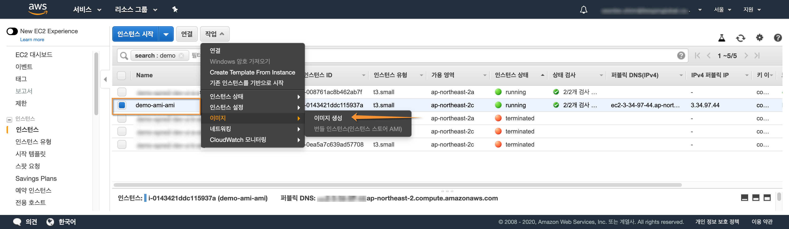
 
  

- 이미지 이름 및 설명을 기입 후 하단의 "이미지 생성" 버튼을 클릭 합니다.
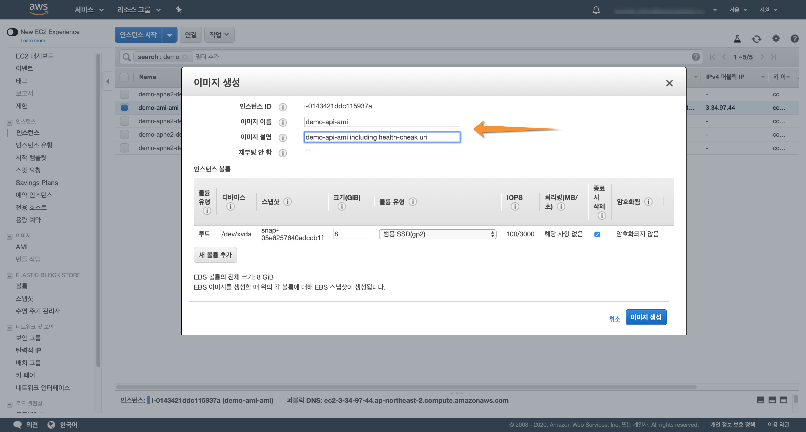
 
  

- 베이스 이미지가 생성된 내역을 확인할 수 있습니다.
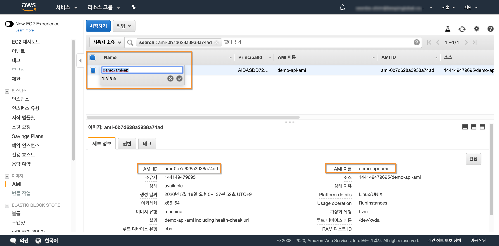
 
 